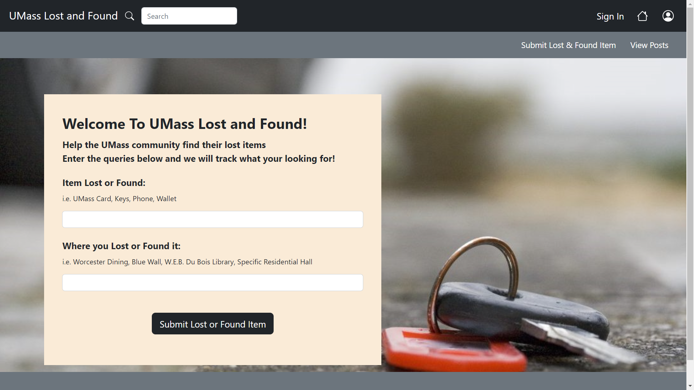

# Team Het
UMass Lost and Found, Fall 2022

## Overview

This website is created for UMass students, faculty, and residents live around Amherst to find their lost items and give them a chance to return the found items. The user of this website will be asked to create an account if they don't have one. Once the account is created, they could feel free to submit the lost or found items by creating posts, and be able to contact with other users through email by seeing all posts. They will also be able to update their posts, delete their posts, and upload images. 
A website like this doesn't exist at UMass Amherst, so it will be innovative and helpful for our town if this website could be put in use.

## Team Members
| | Name | GitHub |
| :------------- | :------------- | :------------- |
|  | Yujin Qin | [nenevadera](https://github.com/nenevadera) |
|  | Kelly Chung | [Kelly2c](https://github.com/Kelly2c) |
|  | Yuqi Liu| [ZephyrusLiu](https://github.com/ZephyrusLiu) |

## User Interface
| Name | Purpose | Screenshot |
| :------------- | :-------------------- | :------------- |
| index | Home Page |  |
| create_account | Page For User To Create Account |
| learn_more | Information About Us Page |
| login | Page For User To Login In | 
| post_detail | Page Contains Details About Certain Item |
| post_page | Page To View All Posts | 
| profile | User's Profile With Personal Information |
| submit_lost_item | Page For Submitting Lost Or Found Items |

## APIs

| Path | Descriptions | Input | Output |
| :------------- | :------------- | :------------- | :------------- |
| \/login | Login | user_name, password | success with user_id or failure |
| \/logout | Logout | NA | success or failure |
| \/user\/create | Create New User | user_name, password, email | success with user_id or failure | 
| \/user\/delete| Delete User | user_id | success or failure | 
| \/user\/update | Update User | user_id, password, user_name, email | success or failure |
| \/user\/view\/id | View User | user_id | user_id, password, user_name, email | 
| \/user\/view\/getall | Get All Users, Same as \/user\/view\/id | NA | list of all users | 
| \/item\/create | Create Item | item_name, item_desc, is_found, image, user_id | success with item_id or failure |
| \/item\/delete | Delete Item | item_id | success or failure |
| \/item\/update | Update Item | user_id, item_id, item_name, item_desc, image, address, is_found,  | success or failure |
| \/item\/view\/id | View Item | item_id | user_id, item_id, item_name, item_desc,  image, address, is_found |
| \/item\/view\/getall | Get All Items, Same as \/item\/view\/id | NA | list of all items |
| \/item\/download\/:name | Upload Image | filename | success with filename or failure |

## Database

## URL Routes / Mappings

## Authentication / Authorization

## Division of Labor
Kelly Chung:

Yuqi Liu:

Yujin Qin:

## Conclusion

## Heroku Application Link
https://umass-lost-and-found.herokuapp.com/
