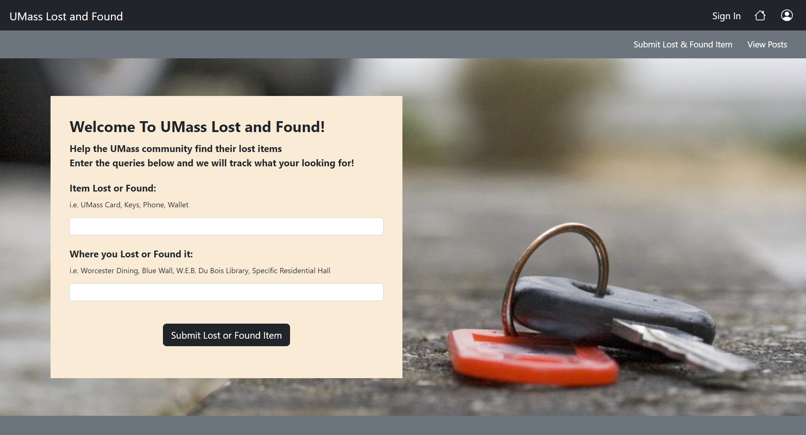
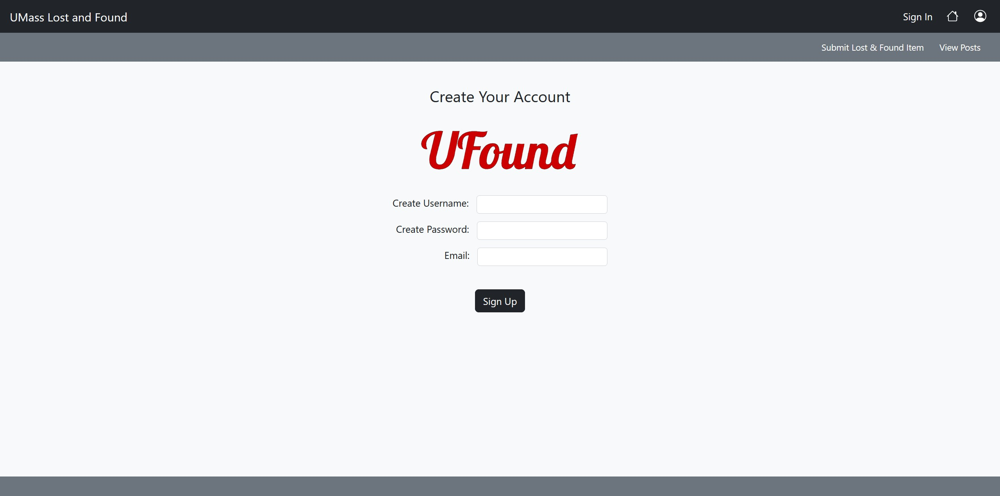
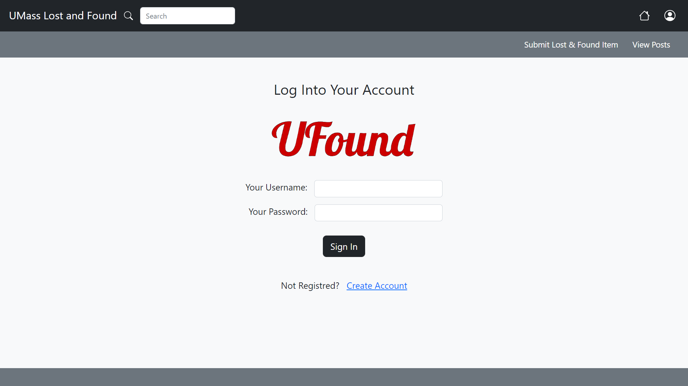
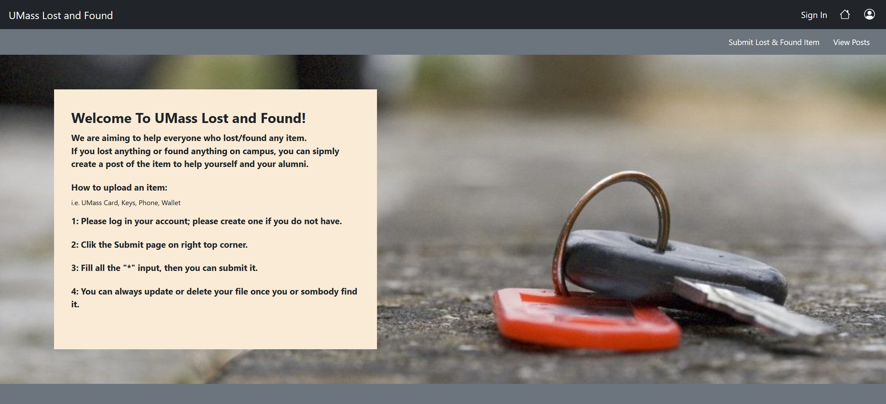
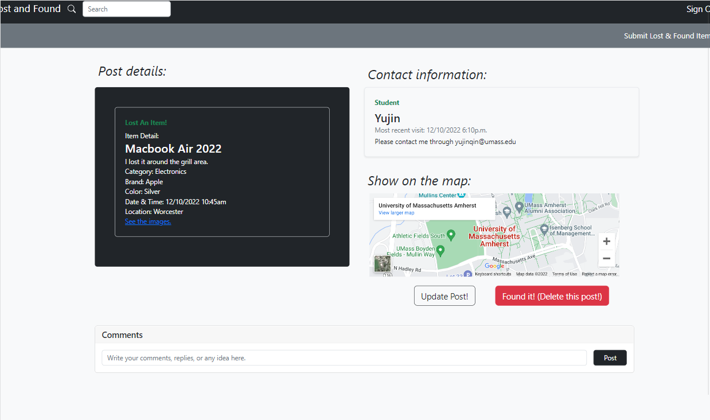
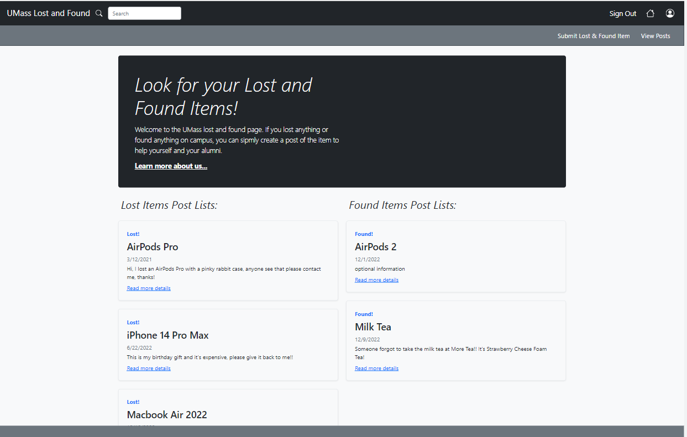
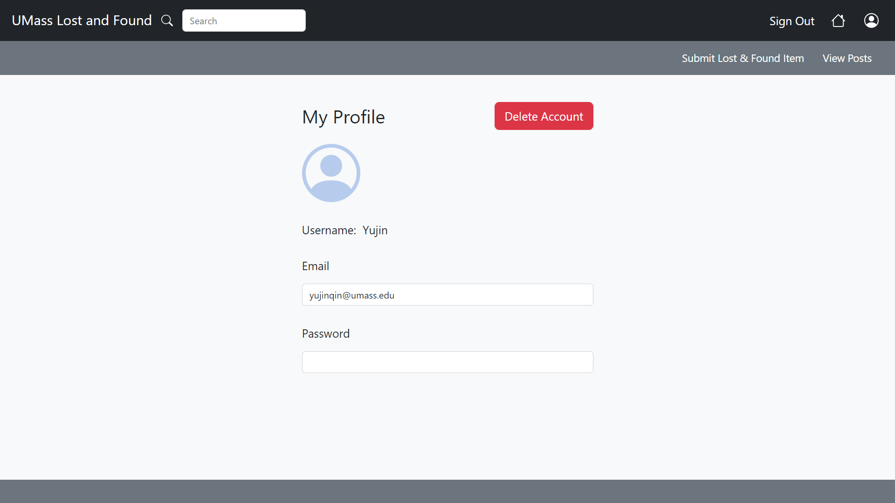
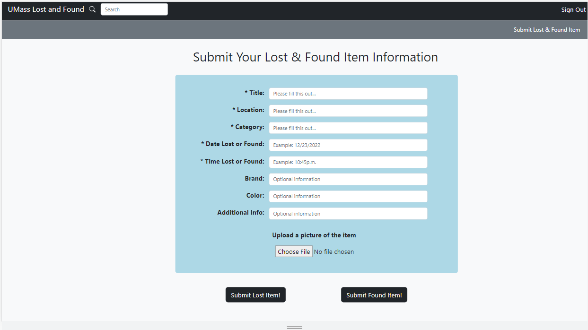

# Team Het
UMass Lost and Found, Fall 2022
## Overview
This website is created for UMass students, faculty, and residents that are related to UMass Amherst to give them a place to find their lost items or post found items on campus. Users can create item posts by creating an account or logging into an existing one. Once the user is logged in they can submit a lost or found item by creating posts. Our users can communicate with each other through their email when they have found or want to claim an item. Users are able to update/delete their posts, attach/remove images to their posts, change their email, or change their password.

A website such as this has not existed at UMass Amherst, so it would be innovative and helpful to our town if this site were to become operational. Lost and Found is a unique platform that provides a valuable service to the UMass Amherst community. It effectively helps UMass students find their lost items in real time.

## Team Members
| | Name | GitHub |
| :------------- | :------------- | :------------- |
|  | Yujin Qin | [nenevadera](https://github.com/nenevadera) |
|  | Kelly Chung | [Kelly2c](https://github.com/Kelly2c) |
|  | Yuqi Liu | [ZephyrusLiu](https://github.com/ZephyrusLiu) |
## User Interface
| Name | Purpose | Screenshot |
| :------------- | :-------------------- | :------------- |
| index | Home Page |  |
| create_account | Page For User To Create Account |  |
| login | Page For User To Login In |  |
| learn_more | Information About Us Page |  |
| post_detail | Page Contains Details About Certain Item |  |
| post_page | Page To View All Posts |  |
| profile | User's Profile With Personal Information |  |
| submit_lost_item | Page For Submitting Lost Or Found Items |  |
## APIs
| Path | Descriptions | Input | Output |
| :------------- | :------------- | :------------- | :------------- |
| \/login | Login | user_name, password | success with user_id or failure |
| \/logout | Logout | NA | success or failure |
| \/user\/create | Create New User | user_name, password, email | success with user_id or failure | 
| \/user\/delete| Delete User | user_id | success or failure | 
| \/user\/update | Update User | user_id, password, user_name, email | success or failure |
| \/user\/view\/id | View User | user_id | user_id, password, user_name, email | 
| \/user\/view\/getall | Get All Users | NA | list of all users | 
| \/item\/create | Create Item | item_name, item_desc, is_found, image, user_id | success with item_id or failure |
| \/item\/delete | Delete Item | item_id | success or failure |
| \/item\/update | Update Item | user_id, item_id, item_name, item_desc, image, address, is_found,  | success or failure |
| \/item\/view\/id | View Item | item_id | user_id, item_id, item_name, item_desc,  image, address, is_found |
| \/item\/view\/getall | Get All Items | NA | list of all items |
| \/item\/upload | Upload Image | Formdata | success with url of image or failure |
| \/item\/download\/:name | Upload Image | filename | success with filename or failure |

## Database
### User
| Name | Data Type | Description |
| :------------- | :------------- | :------------- |
| username | string | Username of the user |
| salt | string | Secret random key to hash |
| hash | string | Hashed value of password |
| email | string | Email of the user |
### Items
| Name | Data Type | Description |
| :------------- | :------------- | :------------- |
| username | string | Username created by user |
| item_name | string | Name of the item, also the title |
| category | string | Category of the item |
| brand | string | Brand of the item |
| color | string | Color of the item |
| date_lost | string | Date that the item lost or found |
| time_lost | string | Time that the item lost or found |
| address | string | Where the item lost or found |
| additional | string | Additional information add by post owner |
| is_found | string | Check the item is lost or found |
| image | string | image url |

### fs.chunks
| Name | Data Type | Description |
| :------------- | :------------- | :------------- |
| _id | ObjectId | The unique ObjectId of the chunk |
| files_id | ObjectId | The _id of the "parent" document |
| n | num | The sequence number of the chunk |
| data | binary | The chunk's payload as a Binary type |

### fs.files
| Name | Data Type | Description |
| :------------- | :------------- | :------------- |
| _id | ObjectId | The unique identifier for this document |
| length | num | The size of the document in bytes |
| chunkSize | num | The size of each chunk in bytes |
| uploadDate | timestamp | The date the document was first stored |
| filename | string | A human-readable name for the file |
| metadata | any | Holds item name and username |
## URL Routes / Mappings
| URL Path | Description | Authentication |
| :------------- | :------------- | :------------- |
| \/login | Login | not required |
| \/logout | Logout | required |
| \/user\/create | Create New User | not required |
| \/user\/delete| Delete User | required |
| \/user\/update | Update User | required |
| \/user\/view\/id | View User | not required |
| \/user\/view\/getall | Get All Users | not required |
| \/item\/create | Create Item | required |
| \/item\/delete | Delete Item | required |
| \/item\/update | Update Item | required |
| \/item\/view\/id | View Item | not required |
| \/item\/view\/getall | Get All Items | not required |
| \/item\/upload | Upload Image | required |
| \/item\/download\/:name | Download Image | not required |
## Authentication / Authorization

### Authentication:
All users are required to create an account with a username, email, and password.
The password is stored in the hash format according to the project standard format.
Such as session id with passport local strategy.

Anyone can browse the posts without loging in, however if they want to create, edit, or delete the data they will have to sign in using their login credentials.

### Authorization:
Anyone can browse any posts.
However only the post owner can modify or delete their post.

## Division of Labor
Kelly Chung:

Yuqi Liu: Come up with the project idea and the initial design. 
Created and completed the HTML and CSS for Submit Lost Item Page, Submit Found Item Page, View Posts Page, View Details Page, and also lean_more.js & .html & .css. Imported map and accomplised the basic functinality. 
Add options to location and category(takes a lot of time, since we have 297 buildings...), create a json file based on the buildings.
Accomplished the basic functionality of uploading image. 
Accomplished functions in server.js, submit_found_item.js, submit_lost_item.js, database.js. Accomplished some of the RESTful API. Accomplised some functionalify and format in .html for related page as well. 
Applied datepicker, timepicker.
Updated the API CRUD. Come up with the initial version of login functionality, and helped with login page. 
Helped with link between post page and post_detail page. Helped with modification of nav bar. Helped with bug fixing.
Created samples for test. 
Made contribution and modification on every milestone.(For future: Accomplished the basic functionality of filter(js,html), but didn't get it used(contains bug). Tried to go accomplish the search bar.)

Yujin Qin: Design and draw all the raw frames of web pages. Rearrange milestone1 markdown file and webpages. 
 Completed post_detail.js, login.js, helped with submit_found_item.js and submit_lost_item.js, helped construct milestone2.md. 
 Generated and completed the post_detail page. Finished delete post function for post_detail page. Helped combine submit lost item page and submit found item page, modified nav bar. Created and finished update_post.js, update_post.html. Helped create some Restful API. Wrote the documentation and how to test the website of milestone3 markdown file. Created samples for testing. 
 Write overview, UI views, APIs, datebase part and help complete the conclusion part in the final.md. Combine and clean up submit_lost_item and update_post together, get rid of useless code/s or file/s. Come up with the raw reply function and comment bar, comment box, add new key to the items database. Complete the setup.md file.

## Conclusion
We had a good learning experience working together and all learned how to use HTML, CSS, and JavaScript to build up a website and make it usable for anyone. We communicated well through Slack with a to-do list and everyone tried their best in the group work. Complete the setup.md file.

The most difficult thing is figuring out the logic, website flow and implementing our ideas. It was quite difficult to work on this website as we though we thought we had thoroughly planned out the structure of the wireframe but realized it was always missing some new logic.  As figuring out the logic and workflow of our website was always quite troublesome as there were so many variables between our users and the data in which they can/cannot interact with.  The many parts of our web were always depending and dependent on each other forcing us to stop a job to fix or create the relying job before we could test or incorporate another part.  

Another challenging problem was applying new technology to the website such as MongoDB, Heroku, passport, image and etc. in which we learned from class in a very short period of time.  This required us to do a lot of research and trial and error to make it functional and easy to traverse/adjust.  

Our team would have like to have had a better design on the wireframe of our website.  We realized while working on this project we came across many instances where there were extra/missing code that we didn't need or needed to add.  For example, at first we had a submit lost, submit found, and update page that were essentially the same except for a couple of buttons and text differences.  We lacked the knowledge/idea to simplify our work until our TA helped and pointed us to a much simpler alternative of combining the 3 pages into 1.  Also, it would be very helpful if everyone had their own branch before we started working because if two people are working on the same file at the same time, some unlucky person will have their code/s overwritten by someone else.
## Heroku Application Link
https://umass-lost-and-found.herokuapp.com/
