# Group Name: 
Het

# Application Name:
Lost and Found map

# Team Overview: 
| | Name | GitHub |
| ------------- |------------- | ------------- |
|  | Yujin Qin | [nenevadera](https://github.com/nenevadera) |
|  | Kelly Chung | [Kelly2c](https://github.com/Kelly2c) |
|  | Yuqi Liu| [ZephyrusLiu](https://github.com/ZephyrusLiu) |

# Data Interactions: 
The general purpose of our project is to efficiently help UMass students to find their lost items in real-time. We want to find a more convenient way of reporting lost or handing in found items. Therefore, we will use an application called "Google Maps" or other map resources for people to check the nearest lost and found station, so they can hand in anything that they find on campus. After people report their lost items and put pieces of information on our application, we will match their data with existing items under the "lost" label to check if someone found it already. Thus, to build the communication with different people, we might use social platforms such as "Instagram" or "Twitter", or even "iMessage" by phone number. 

In our application, we will have at least four different sources of data: post, reply, images, and map data. For the "post", users of our application are able to create a post with information that the item they found or lost. For the "reply", users of our application are able to reply to a post such as "I also saw this item at xx time xx location". For "images", users are able to upload images to specify the details of their lost or found items. For "map", users who lost something will get notified on the map once other users found items that match your description or reply to your post with location information.

# User Interface
## Dashboard Page
This is the dashboard page once the user clicked or entered the link.

Hand draft version.

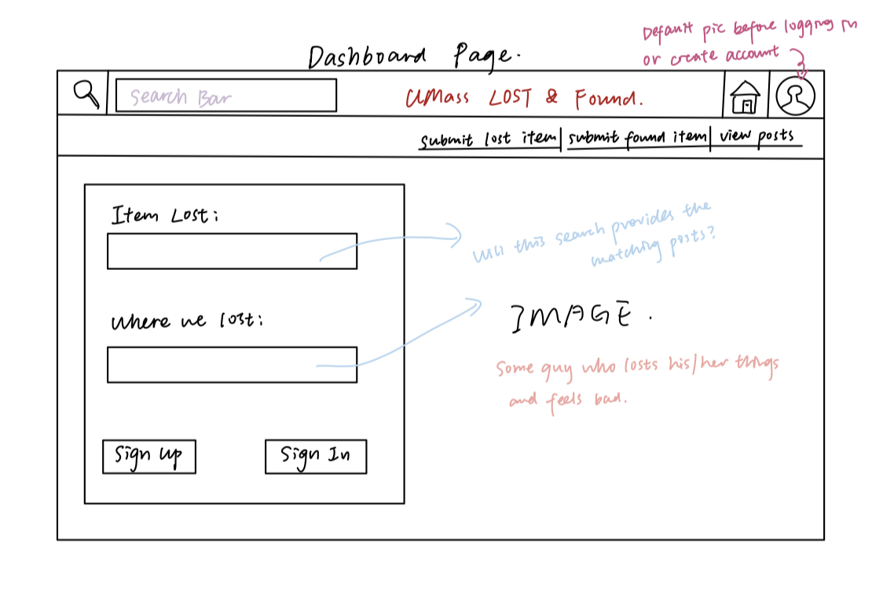

HTML version.

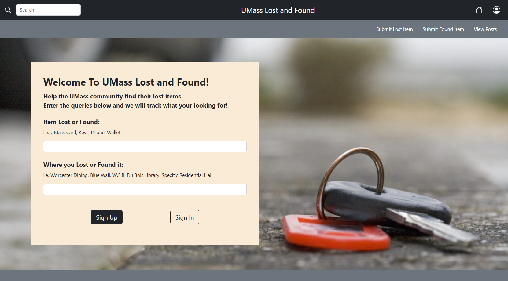

## Login Page
This is the login page for users who own an account to log in.

Hand draft version.

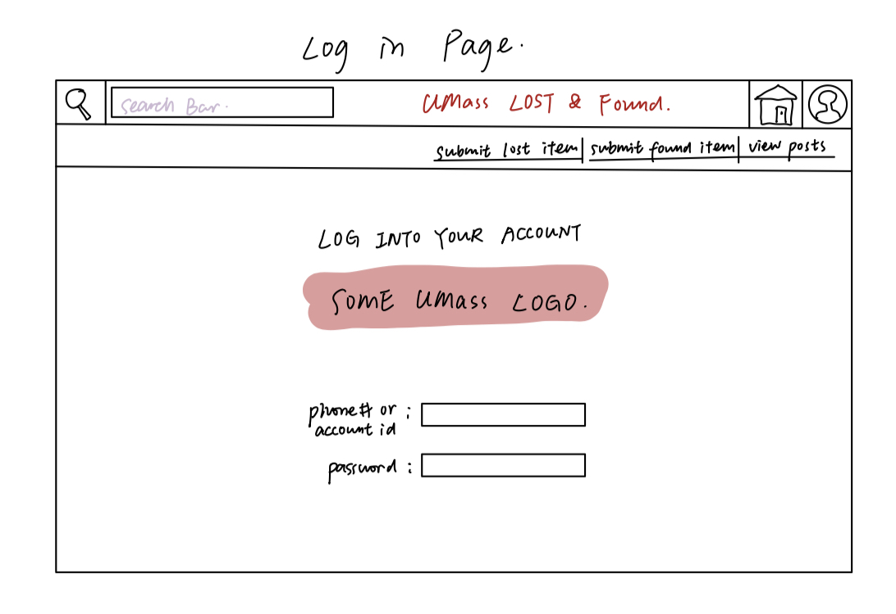

HTML version.

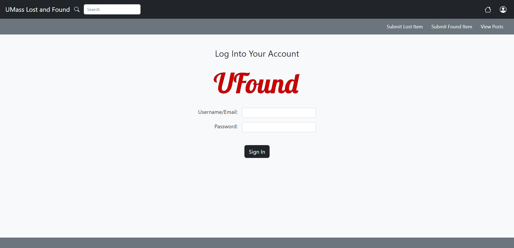

## Create Account Page
This is the create account page for users who does not own an account to create one.

Hand draft version.

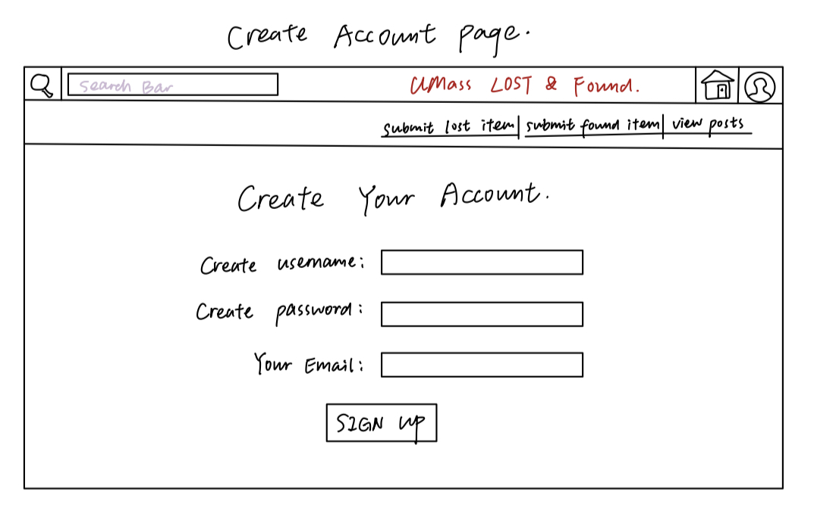

HTML version.

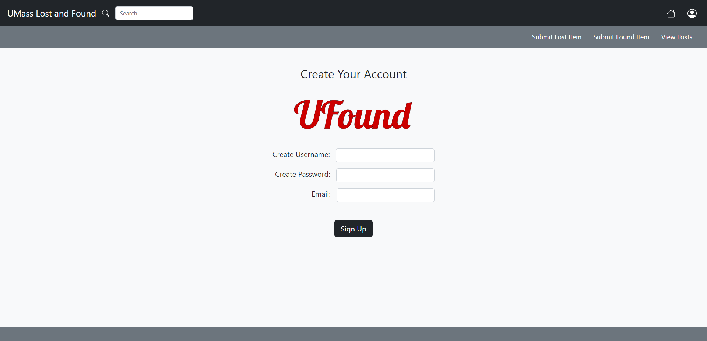

## Submit Lost Item Page
This is the submit lost item page for users who lost items and want to create a post to find their items.

Hand draft version.

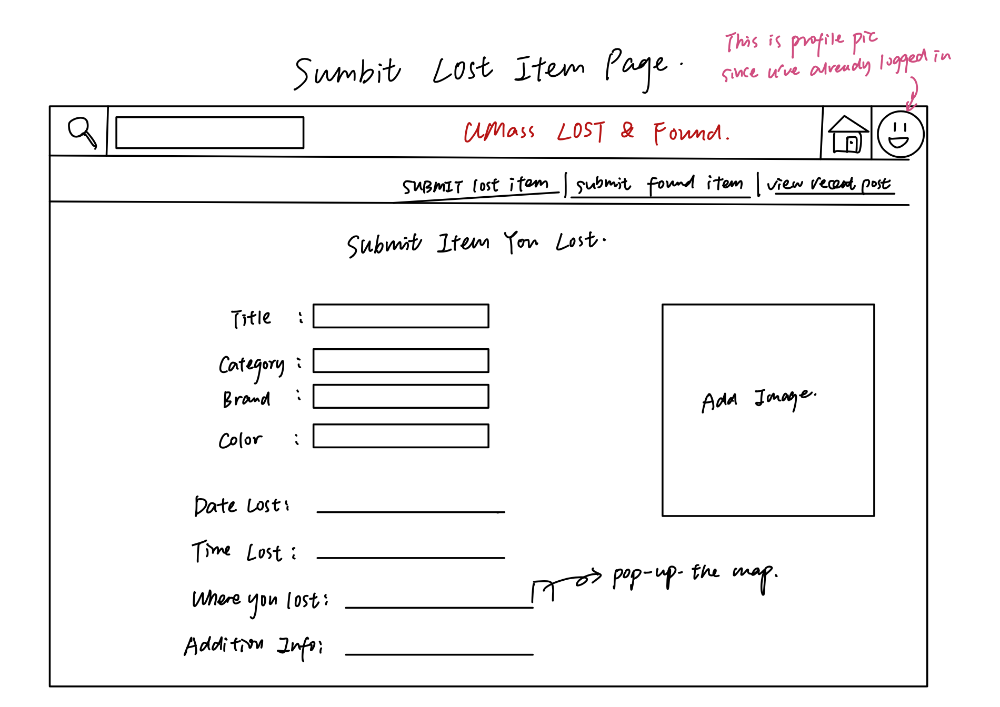

HTML version

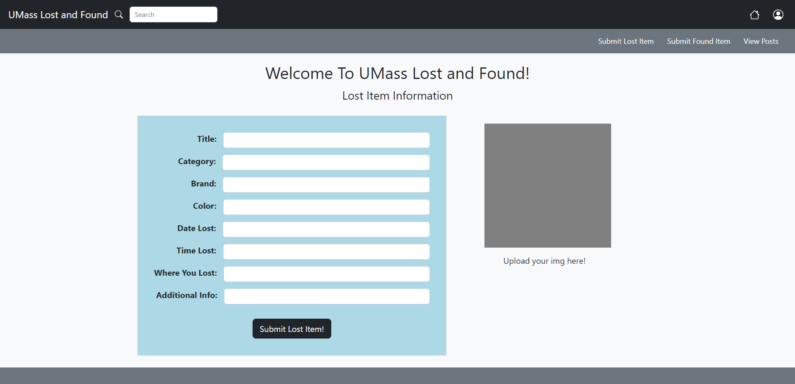

## Submit Found Item Page
This is the submit found item page for users who found items but don't know the owner, and want to create posts to find the owner of the items they found.

Hand draft version.

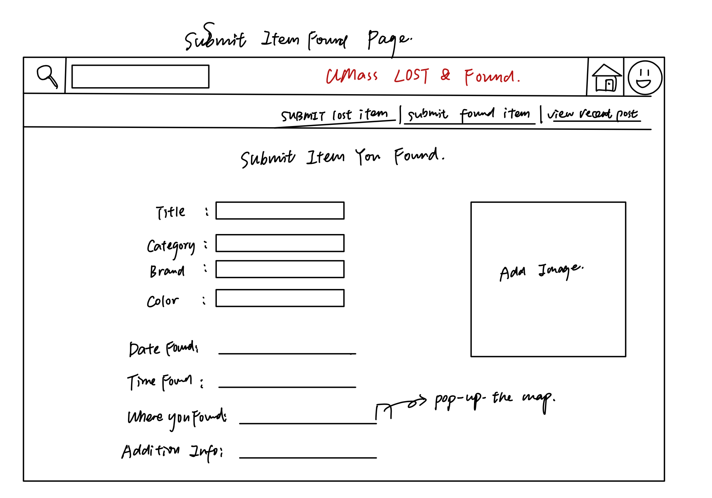

HTML version

## View Posts Page
This is the view all posts page for users to view all posts quickly by provided short informations. Users could click "view details" on the top of each post to see the detail information.

Hand draft version.

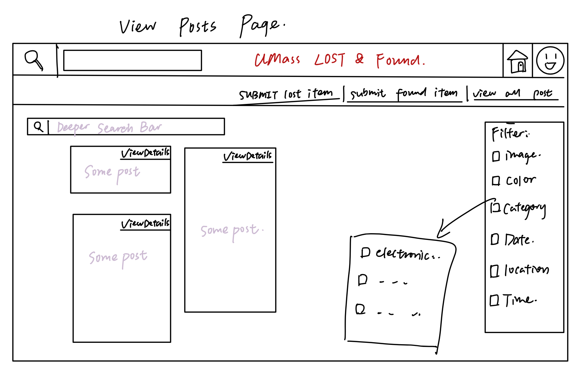

HTML version

## View Posts Details Page
This is view posts details page for users who wants to get more information about this post. It will show all the informations about this lost or found item.

Hand draft version.

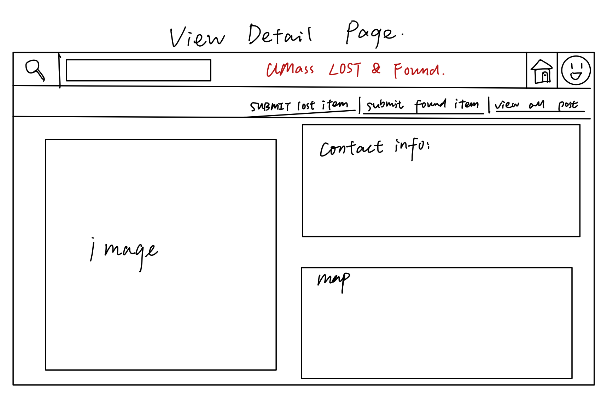

HTML version

## Division of Labor
Kelly Chung: Created the HTML and CSS for Navigation Bar, Dashboard page, Login page, Create Account page, and also realigned Submit Lost Item page.  Also helped design the draft for the website.

Yuqi Liu:

Yujin Qin: