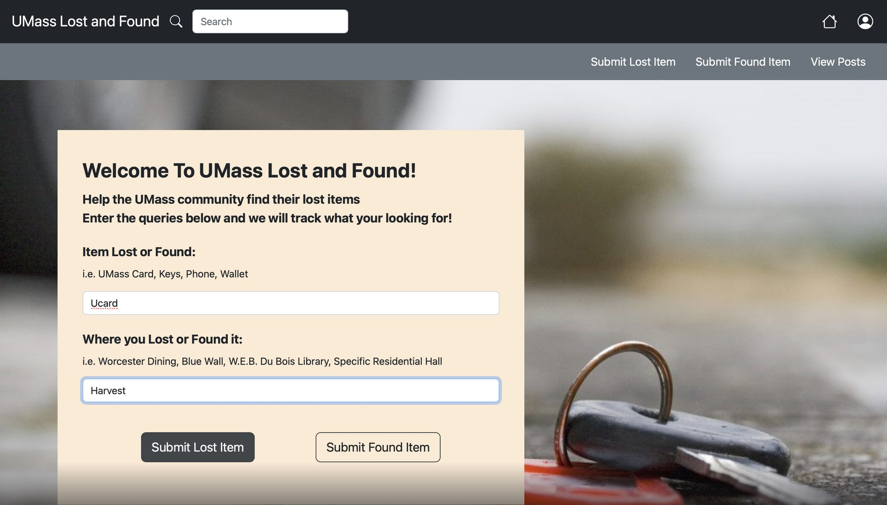
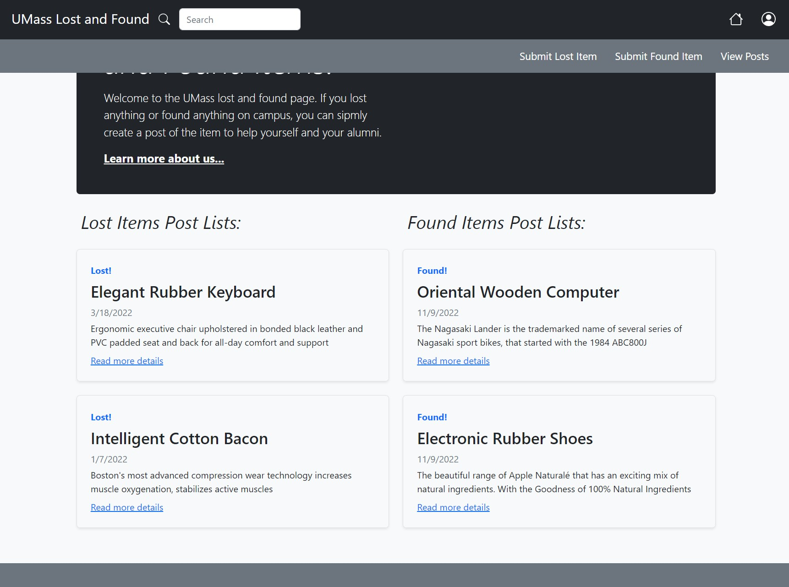
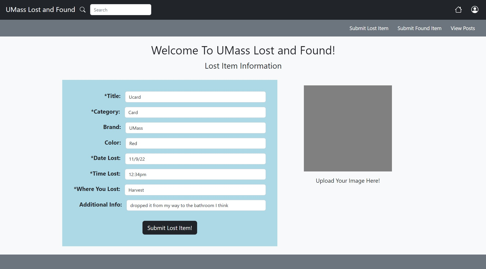
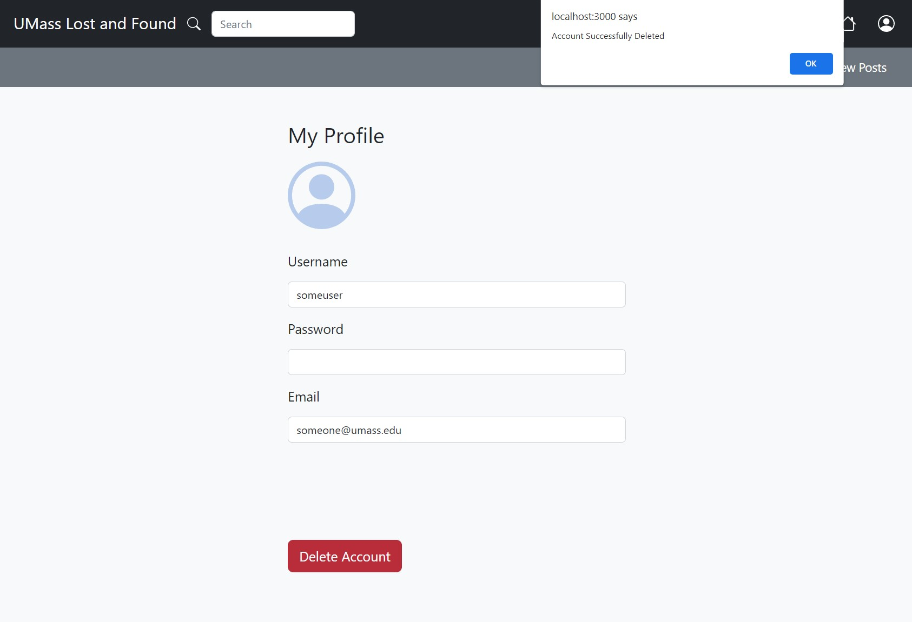

# Group Name: 
Het

# Team Overview: 
| | Name | GitHub |
| ------------- |------------- | ------------- |
|  | Yujin Qin | [nenevadera](https://github.com/nenevadera) |
|  | Kelly Chung | [Kelly2c](https://github.com/Kelly2c) |
|  | Yuqi Liu| [ZephyrusLiu](https://github.com/ZephyrusLiu) |

# Database Objects:

| user Objects | PostgreSQL Type |
| :------------- | :------------- |
| user_id | Numeric |
| password | Character |
| user_name | Character |
| email | Character |

| item Objects | PostgreSQL Type |
| :------------- | :------------- |
| user_id | Numeric |
| item_id | Numeric |
| item_name | Character |
| item_desc | Character |
| image | Bytea |
| address | Character |
| is_found | Boolean |

# API CRUD Operations:

| Path | Descriptions | Input | Output |
| :------------- | :------------- | :------------- | :------------- |
| \/login | Login | user_name, password | success with user_id or failure |
| \/logout | Logout | NA | success or failure |
| \/user\/view\/create | Create New User | user_name, password, email | success with user_id or failure | 
| \/user\/view\/delete| Delete User | user_id | success or failure | 
| \/user\/view\/update | Update User | user_id, password, user_name, email | success or failure |
| \/user\/view\/id | View User | user_id | user_id, password, user_name, email | 
| \/user\/view\/getall | Get All Users | NA | list of all users | 
| \/item\/create | Create Item | item_name, item_desc, is_found, image, user_id | success with item_id or failure |
| \/item\/view\/delete | Delete Item | item_id | success or failure |
| \/item\/view\/update | Update Item | user_id, item_id, item_name, item_desc, image, address, is_found,  | success or failure |
| \/item\/view\/id | View Item | item_id | user_id, item_id, item_name, item_desc,  image, address, is_found |
| \/item\/view\/getall | Get All Items | NA | list of all items |

## Heroku Application Link
https://umass-lost-and-found.herokuapp.com/

## CRUD Screenshots

## Division of Labor
Kelly Chung: Constructed the initial version of milestone markdown file, server.js, database.js, webpages.js, added express server, database objects and fields definitions, RESTful API CRUD documentation and faker data.  Created events and logics functionality for Navigation Bar, Dashboard Page, Submit Lost Item Page, Profile Page, and, Post Pages Page.  Setup Heroku auto-deploy and Github Connection.

Yuqi Liu: Accomplished functions in server.js, submit_found_item.js, submit_lost_item.js, database.js. Accomplished some of the RESTful API. Accomplised some functionalify and format in .html for related page as well. Helped with login page. Updated the API CRUD Operations in milestone2.

Yujin Qin: Completed post_detail.js, login.js, helped with submit_found_item.js and submit_lost_item.js
